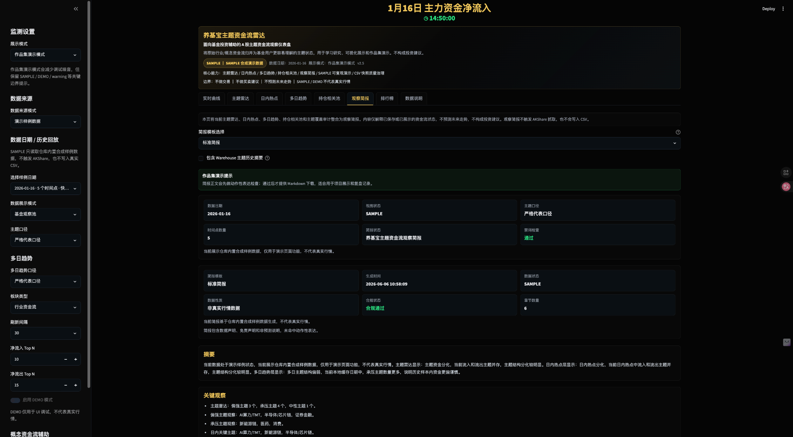
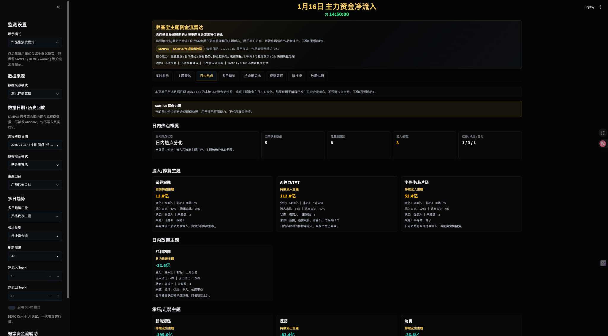
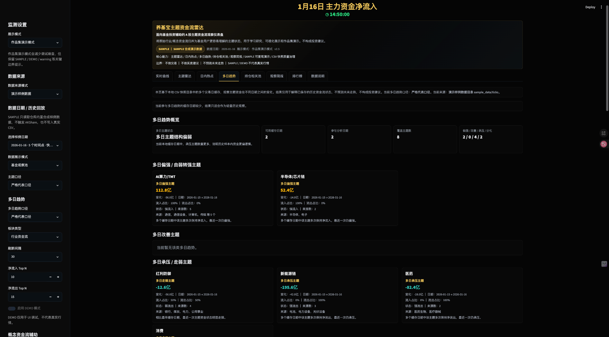
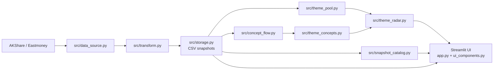

# Fund Flow Monitor / 养基宝主题资金流雷达

A Streamlit-based A-share fund-flow dashboard with theme radar, intraday hotspots, multi-day trends, holding-related pools, taxonomy audit, observation brief export, and reproducible SAMPLE mode.

> 本项目用于学习研究、可视化展示和基金主题观察。它不是基金净值工具，不是股票交易系统，不提供买卖建议，也不预测未来走势。

## 1. Project Overview

Fund Flow Monitor（养基宝主题资金流雷达）是一个基于 **Streamlit、AKShare、Plotly 和 pandas** 构建的 A 股主题资金流监测 MVP。项目使用 AKShare 获取东方财富行业/概念板块主力资金流数据，将盘中快照保存为本地 CSV，并通过“基金观察池”把原始行业板块归并为更适合基金投资观察的主题，例如半导体/芯片链、AI算力/TMT、新能源链、红利防御、医药和证券金融。

项目重点不是提供交易信号，而是解决普通资金流排行榜中常见的三个问题：

1. **数据状态不透明**：页面明确区分 `LIVE / CACHE / HISTORY / SAMPLE / DEMO / EMPTY`，避免将缓存、历史回放、样例数据或模拟数据误认为实时行情。
2. **板块层级容易重复计数**：系统提供严格代表口径、代表口径和广度观察三种主题口径，用于区分核心板块资金流和主题热度观察。
3. **原始行业列表不够贴近基金视角**：通过关注主题雷达、今日资金温度、核心/广度分歧提示和 watchlist 配置，将资金流信息组织成更适合基金辅助观察的主题雷达。

这个项目面向“养基宝 / 基金投资辅助”场景：它不是普通基金净值工具，也不是交易系统。页面中的资金温度、主题雷达、分歧提示只用于观察已发生的资金流状态。

明确边界：

- 不提供交易功能。
- 不提供投资建议。
- 不预测未来走势。
- 免费数据源仅用于学习、研究和原型验证。

## 2. Key Features

- 实时主力资金净流入曲线：深色 Plotly 折线图，右侧 endpoint label 显示主题/板块和当前金额。
- `LIVE / CACHE / HISTORY / SAMPLE / DEMO / EMPTY` 数据状态：区分本轮实时抓取、真实缓存、历史回放、合成样例数据、模拟数据和空缓存。
- 演示样例数据模式：仓库内置 `sample_data/ticks/` 合成 CSV，新用户无网络、无真实缓存时也能体验主要功能。
- 基金观察池：将相近行业/概念归并为基金投资相关主题。
- 三种主题口径：严格代表口径、代表口径、广度观察。
- 今日资金温度：基于主题资金状态计算整体主题资金冷热。
- 关注主题雷达：按 `config/watchlist.json` 展示自选主题状态。
- 核心/广度分歧提示：对比核心板块和广度观察是否共振或分化。
- 低频概念资金流辅助：手动或过期刷新概念缓存，用于观察主题相关概念热度。
- 持仓相关池：基于 `config/fund_profiles.json` 的手动主题配置，把关注基金/ETF 映射到当前主题资金状态。
- 日内热点池：基于本地 CSV 多个 captured_time，解释主题资金流的日内变化、持续性和分化。
- 历史快照回放：选择已有 CSV 日期，回看当日曲线、主题雷达、日内热点、持仓相关池和排行榜。
- 多日主题趋势：基于多个本地 CSV 日期的最后快照，观察主题资金状态的跨日期变化。
- 主题库配置化：通过 `config/theme_taxonomy.json` 管理主题定义、核心行业、相关行业和概念关键词。
- 主题覆盖审计：检查当前快照覆盖率、高资金流未覆盖板块、重复映射和 watchlist / fund_profiles 一致性。
- 观察简报：整合主题雷达、日内热点、多日趋势、持仓相关池和覆盖审计，并支持 Markdown 下载。
- CSV 数据质量面板：展示快照日期、行数、时间点数量、行业/概念行数和质量标签。
- 深色金融大屏：黑色背景、弱网格、深色排行榜和紧凑状态条。
- 本地 CSV 快照：第一版不依赖数据库，便于调试和迁移。

## First-run Experience

新用户 clone 仓库或打开 Streamlit Cloud 时，通常没有本地真实 `data/ticks/*.csv`。v1.5 的默认体验是：

- 真实数据模式继续保持可信状态，不把缓存、历史、样例或模拟数据伪装为实时行情。
- 如果 AKShare 暂不可用或真实缓存为空，页面会提示切换到 `SAMPLE 演示样例数据`。
- SAMPLE 模式读取仓库内置合成 CSV：`sample_data/ticks/*.csv`。
- SAMPLE 模式可以展示实时曲线、主题雷达、日内热点、多日趋势、持仓相关池、观察简报、排行榜和数据说明。
- SAMPLE 模式不触发 AKShare，不读取真实缓存，也不会写入 `data/ticks`。

## Portfolio Description

这是一个从“复刻资金流动态图”进一步升级为“基金主题资金流雷达”的数据可视化项目。系统不仅展示 A 股行业/主题主力资金净流入曲线，还通过可解释的主题归并、三档口径和自选 watchlist，将原始板块资金流转换成更适合基金投资辅助观察的产品化视图。

核心设计包括：

- **可信数据状态**：通过 `LIVE / CACHE / HISTORY / SAMPLE / DEMO / EMPTY` 避免缓存、历史回放、样例数据或模拟数据被误解为实时行情。
- **可解释主题口径**：通过严格代表口径、代表口径、广度观察区分核心板块资金流与主题热度。
- **基金观察池**：将原始行业板块映射为基金主题，支持半导体/芯片链、AI算力/TMT、新能源链、红利防御、医药、证券金融等观察方向。
- **产品化雷达层**：提供今日资金温度、关注主题雷达、核心/广度分歧提示和资金流排行榜。
- **统一解释层**：通过观察简报把主题雷达、热点、趋势、持仓相关池和主题覆盖审计整合为一份可下载 Markdown。
- **轻量 MVP 架构**：使用 Streamlit + Plotly + AKShare + CSV 快照实现快速验证，后续可平滑升级到 FastAPI + React + ECharts。

## 3. Screenshots

### Real-time Fund Flow Curve

The real-time curve tab visualizes intraday main capital net inflow by selected fund themes or raw sectors. It keeps the dark financial dashboard style, shows the current data state, and marks endpoint labels on the right side of the chart.


### Fund Theme Radar

The theme radar tab summarizes current market temperature, watchlist theme status, and core-vs-breadth divergence. This is the key product layer that turns raw sector flow data into fund-oriented observation signals.


### Fund Flow Ranking

The ranking tab separates net inflow and net outflow lists. Inflow ranking only shows positive values, while outflow ranking only shows negative values, avoiding mixed-sign ranking confusion.


### Observation Brief

The observation brief tab combines theme radar, intraday hotspots, multi-day trends, holding-related pool, and theme coverage audit into one Markdown-ready report. It only explains displayed or cached fund-flow states and does not predict future market moves.



### Holding Related Pool

The holding-related pool maps manually configured fund/ETF theme exposure to current theme fund-flow status. It does not read real accounts and does not represent real holdings.


### Intraday Hotspots

The intraday hotspot tab explains how theme fund-flow changes across local CSV snapshots during the same trading day. It observes completed intraday changes only and does not predict future moves.



### Historical Snapshot Replay

The history replay view lets users choose an existing local CSV date and review that day without triggering AKShare requests or writing new snapshots.


### Multi-day Theme Trends

The multi-day trend tab compares the latest theme snapshot from each cached CSV date. It only explains saved historical fund-flow states and does not predict future moves.



### CSV Snapshot Catalog

The data explanation tab includes a CSV snapshot catalog and quality labels for each cached date.


### Sample Data Mode

The sample mode uses bundled synthetic CSV snapshots under `sample_data/ticks/`, so a freshly cloned repository can demonstrate the curve, theme radar, intraday hotspots, multi-day trends, holding-related pool, and observation brief without network access or real local cache.


### Theme Taxonomy

The data explanation tab documents the configurable fund-theme taxonomy, including primary sectors, related sectors, concept keywords, aliases, and overlap notes.


### Theme Coverage Audit

The coverage audit explains how much of the latest sector snapshot is covered by the theme taxonomy and highlights high-flow sectors that are not yet mapped.


### Data Trust Panel

The data explanation tab shows the current data source, `LIVE / CACHE / HISTORY / SAMPLE / DEMO / EMPTY` state, latest cache time, CSV snapshot count, theme mode explanation, watchlist usage, and disclaimer.


## 4. Architecture



## 5. Data Flow

1. 页面每次 rerun 时判断 A 股市场状态。
2. 交易中、集合竞价或午间休市时尝试抓取行业资金流数据。
3. 抓取成功：标准化字段，追加写入 `data/ticks/sector_flow_YYYY-MM-DD.csv`，页面显示 `LIVE`。
4. 抓取失败或非交易时段：优先读取最近真实 CSV 缓存，页面显示 `CACHE`。
5. 用户选择历史日期时：只读取所选日期本地 CSV，页面显示 `HISTORY`，不会触发 AKShare 抓取，也不会写入 CSV。
6. 演示样例数据模式：只读取 `sample_data/ticks/` 合成 CSV，页面显示 `SAMPLE`，不会触发 AKShare，也不会写入 `data/ticks`。
7. 本地没有可用真实 CSV 时：页面显示 `EMPTY`，不会崩溃，并提示使用样例数据或 DEMO。
8. DEMO 模式：只在内存生成模拟数据用于 UI 调试，页面显示 `DEMO`，不会写入真实 CSV。
9. 概念资金流采用低频策略：用户手动刷新、概念缓存为空或缓存超过 5 分钟时才尝试抓取。
10. 概念资金流只作为主题热度和分化的辅助观察数据，不与行业资金流直接相加。

## 6. Theme Modes

基金观察池不是简单求和，而是提供三种解释口径：

- `strict_representative / 严格代表口径`：只使用主题核心板块的精确匹配；若核心板块不存在，才使用精确匹配的相关板块作为替代并标记。默认使用该口径，最克制。
- `representative / 代表口径`：优先使用核心板块精确匹配，必要时允许核心板块包含匹配或相关板块 fallback。
- `breadth / 广度观察`：聚合核心板块和更多相关板块，用于观察主题热度。这个数值可能包含上下级板块重叠，不代表严格净流入。

当前主题映射仍是轻量规则，未来需要结合基金持仓、ETF 成分、申万/中信等行业分类体系继续校准。

## 7. Concept Assistance

v0.7 增加低频概念资金流辅助：

- 默认不会每 30 秒抓取概念资金流。
- 侧边栏开启“概念资金流辅助”后，可以点击“刷新概念资金流”。
- 当概念缓存为空或距离当前时间超过 5 分钟时，系统才会尝试低频刷新。
- 概念接口失败不会影响行业资金流主图、排行榜和主题雷达主链路。
- 概念数据写入同一个 CSV，但通过 `sector_type="概念资金流"` 与行业数据区分。
- 主题雷达中的“相关概念热度”只用于辅助观察，不替代行业主题主值。
- 行业资金流和概念资金流不会直接相加。

## 8. Fund Profiles

v0.8 增加本地手动配置版持仓相关池：

```text
config/fund_profiles.json
```

配置示例：

```json
{
  "profile_name": "默认基金关注组合",
  "description": "本配置仅用于本地主题观察示例，不代表真实持仓。",
  "funds": [
    {
      "fund_name": "半导体主题基金示例",
      "fund_code": "DEMO-SEMI",
      "fund_type": "主题基金",
      "themes": [
        {"theme_name": "半导体/芯片链", "weight": 0.75},
        {"theme_name": "AI算力/TMT", "weight": 0.15},
        {"theme_name": "新能源链", "weight": 0.10}
      ]
    }
  ]
}
```

说明：

- `fund_code` 示例使用 `DEMO-` 前缀，避免误解为真实基金代码。
- `themes` 是手动主题配置，不代表真实基金持仓。
- 系统不读取真实账户，不接券商接口，不抓取个人持仓。
- 权重仅用于把关注基金/ETF 映射到当前主题资金状态。
- 持仓相关池不预测基金净值，不构成投资建议。

## 9. Intraday Hotspots

v0.9 增加日内热点池：

- 数据来源只使用本地 CSV 中同一交易日的行业资金流快照。
- 通过多个 `captured_time` 构建主题日内历史。
- 计算 first/latest/max/min、日内变化、排名变化、流入/流出时间占比。
- 将主题分为持续流入、日内改善、由弱转强、持续流出、日内走弱和分化观察。
- 如果 `captured_time` 少于 2，页面只显示“快照数量不足”的提示，不做异动判断。
- 日内热点只解释已经发生的资金流变化，不预测未来走势，不构成投资建议。

## 10. Historical Snapshot Replay

v1.0 增加历史快照回放和数据日期选择：

- 侧边栏可选择“自动使用最新缓存”或“选择历史日期”。
- 历史日期来自 `data/ticks/sector_flow_YYYY-MM-DD.csv`。
- 选择历史日期后，实时曲线、主题雷达、日内热点、持仓相关池和排行榜都会基于所选日期的 CSV。
- `HISTORY` 状态表示本页展示本地历史缓存，不代表实时行情。
- 历史回放不会触发 AKShare 抓取，也不会写入 CSV。
- `数据说明` tab 会展示 CSV 快照目录，包括行数、时间点数量、行业行数、概念行数、文件大小和质量标签。
- 如果没有任何可读 CSV，页面显示 `EMPTY`，可等待正常抓取或启用 DEMO 测试 UI。

质量标签：

- `快照较完整`：时间点不少于 10 个且有行业资金流。
- `快照可回放`：时间点 2-9 个且有行业资金流。
- `仅单点快照`：只有 1 个时间点，不能判断完整日内变化。
- `缺少行业资金流`：不能构建主题主链路。
- `文件异常`：CSV 不可读或缺少关键字段。

## 11. Multi-day Theme Trends

v1.1 增加多日主题趋势：

- 数据来源只使用 `data/ticks/` 中已有的多个 `sector_flow_YYYY-MM-DD.csv`。
- 每个日期取最后一个行业资金流 `captured_time`，再构建主题快照。
- 支持严格代表口径、代表口径和广度观察三种多日趋势口径。
- 多日趋势独立于当前 `selected_snapshot_date`，不会因为你正在回放某一天就只分析那一天。
- 如果本地可用日期少于 2 个，页面会显示日期不足提示，不崩溃。
- 多日趋势不会触发 AKShare 抓取，也不会写入 CSV。
- 趋势标签只解释已保存历史缓存中的资金状态变化，不预测未来走势，不构成投资建议。

趋势标签包括：

- 多日偏强主题
- 多日改善主题
- 由弱转强主题
- 多日承压主题
- 多日走弱主题
- 多日分化主题

## 12. Theme Taxonomy And Coverage

v1.2 增加主题库配置化和覆盖审计：

```text
config/theme_taxonomy.json
```

主题库字段包括：

- `theme_name`: 主题名称，需要尽量和 watchlist / fund_profiles 保持一致。
- `theme_group`: 主题分组，例如科技成长、新能源、稳健防御。
- `primary_sectors`: 严格代表口径优先使用的核心行业。
- `related_sectors`: 代表口径 fallback 或广度观察使用的相关行业。
- `concept_keywords`: 低频概念资金流辅助使用的关键词。
- `aliases`: 主题别名。
- `fund_use_case`: 适合观察的基金主题场景。
- `overlap_notes`: 上下级或交叉口径提示。

覆盖审计会检查：

- 当前最新行业资金流快照中有多少板块被主题库覆盖。
- 哪些高资金流板块尚未纳入主题库。
- 哪些 sector 同时出现在多个主题中。
- watchlist / fund_profiles 中的主题是否都注册在主题库中。

说明：

- 主题库是轻量规则，不等同于正式行业分类。
- 覆盖率用于审计当前主题库对全市场板块的覆盖情况；由于本项目主题库定位为基金观察池，而非全市场行业分类体系，因此覆盖率偏低不代表数据异常，只说明当前主题库只覆盖重点基金主题，后续可继续人工扩展。
- 覆盖审计只用于解释主题归并质量，不预测未来走势，不构成投资建议。
- 主题覆盖审计不会触发 AKShare 抓取，也不会写入 CSV。

## 13. Observation Brief

v1.3 增加观察简报和统一解释层：

- 简报整合当前数据日期、主题雷达、日内热点、多日趋势、持仓相关池和主题覆盖审计。
- 简报只复用页面已生成的 DataFrame / dict 结果，不触发 AKShare 抓取，也不会写入 CSV。
- 简报会说明 `LIVE / CACHE / HISTORY / SAMPLE / DEMO / EMPTY` 视图状态、主题口径和快照时间点数量。
- 如果日内或多日样本不足，简报会明确写出样本不足说明，不会强行判断。
- Markdown 下载通过 `st.download_button` 实现，文件名格式为 `yangjibao_brief_YYYY-MM-DD.md`。
- 下载前会做动作性表达检查；如果命中禁词，页面会显示 warning 并关闭下载。

观察简报仍然只是资金流状态说明，不预测未来走势，不构成投资建议。

## 14. Sample Data Mode

v1.4 增加可复现演示样例数据：

```text
sample_data/ticks/sector_flow_2026-01-15.csv
sample_data/ticks/sector_flow_2026-01-16.csv
```

说明：

- `sample_data` 是合成演示数据，不是真实行情。
- 样例 CSV 带有 `source=SAMPLE` 和 `data_mode=SAMPLE` 标记。
- `sample_data/ticks/*.csv` 会提交到 GitHub，方便首次运行和作品集演示。
- `data/ticks/*.csv` 是真实本地缓存，继续被 `.gitignore` 忽略。
- SAMPLE 模式不触发 AKShare，不读取真实缓存，不写入 `data/ticks`。
- SAMPLE 与 `HISTORY` 区分：`HISTORY` 只表示真实本地 CSV 历史回放。
- SAMPLE 与 `DEMO` 区分：`DEMO` 是内存模拟 UI 数据，SAMPLE 是仓库内置只读合成 CSV。

首次运行建议：

1. 使用“真实数据 / 本地缓存”等待 AKShare 抓取成功。
2. 如果没有网络或接口失败，选择“演示样例数据”体验完整功能。
3. 如需重新生成样例包，可运行 `python tools/generate_sample_data.py`。

## 15. Watchlist

关注主题来自：

```text
config/watchlist.json
```

示例：

```json
{
  "watchlist_name": "默认关注主题",
  "themes": [
    "半导体/芯片链",
    "AI算力/TMT",
    "新能源链",
    "红利防御",
    "医药",
    "证券金融"
  ]
}
```

可以手动增删 `themes` 中的主题名称。配置文件缺失或损坏时，程序会回退到默认关注主题。

## 16. Quick Start

```bash
git clone <repo-url>
cd fund-flow-monitor
python3 -m venv .venv
source .venv/bin/activate
pip install -r requirements.txt
python tools/generate_sample_data.py
streamlit run app.py
```

首次打开页面后：

1. 选择 `真实数据 / 本地缓存`：使用 AKShare 和本地真实 CSV。
2. 选择 `演示样例数据`：使用合成 SAMPLE 数据完整体验页面。
3. 开启 `DEMO`：仅测试 UI，不写入 CSV。

可选：先检查 AKShare 接口。

```bash
python tools/probe_akshare.py
python tools/probe_concept_flow.py
```

## 17. Streamlit Cloud Deployment

部署到 Streamlit Cloud 时：

- Main file path: `app.py`
- Python dependencies: `requirements.txt`
- Theme and headless config: `.streamlit/config.toml`
- Secrets: 当前项目不需要 secrets；如未来需要，请在 `.streamlit/secrets.toml` 本地配置，仓库只提交 `.streamlit/secrets.example.toml`。
- Real cache: `data/ticks/*.csv` 不提交到 GitHub。
- Demo package: `sample_data/ticks/*.csv` 会提交到 GitHub，用于公开演示和离线体验。

如果云端 AKShare 访问不稳定，页面仍可通过 SAMPLE 模式展示完整产品能力。SAMPLE 是合成数据，不代表真实行情。

## 18. Validation

```bash
python -m pytest -q
python -m compileall app.py src tests tools
python tools/smoke_check.py
python tools/verify_runtime.py
```

`tools/smoke_check.py` 不进行网络抓取，只检查 Python 版本、关键依赖、关键文件、watchlist、快照目录、本地 CSV 摘要和 sample catalog。`tools/verify_runtime.py` 会进一步检查 AKShare 可用性、CSV 缓存、历史回放候选日期、主题池、主题雷达、分歧提示和 SAMPLE 样例链路。

## 19. Known Limitations

- AKShare / 东方财富免费接口可能受网络、代理、上游字段变化和访问限制影响。
- 当前暂未处理中国法定节假日，仅按周一至周五和盘中时间段判断市场状态。
- 当前使用 CSV，不适合长期生产环境。
- 主题映射仍是轻量规则，不等同于正式行业分类。
- 后续需要结合基金持仓、ETF 成分、行业分类体系继续校准主题池。
- 广度观察可能包含上下级板块重叠，只能作为主题热度观察。
- 概念资金流接口可能比行业接口更不稳定，因此当前只做低频辅助刷新。
- 持仓相关池只读取本地手动配置，不代表真实基金持仓或账户资产。
- 日内热点池依赖本地 CSV 快照数量，快照过少时无法判断日内变化。
- 历史回放只读取单日 CSV，暂未提供多日趋势对比或跨日回放动画。
- 多日趋势目前只基于每个 CSV 日期的最后快照，暂未提供多日趋势折线图或更复杂的统计。
- 主题库仍是轻量人工规则，需要后续结合基金持仓、ETF 成分和行业分类体系持续校准。
- 观察简报是基于当前页面结果的规则化摘要，不调用大模型，不生成预测结论。
- SAMPLE 样例数据是人工合成的演示包，只用于复现页面功能，不代表真实行情。
- Streamlit Cloud 上 AKShare 访问可能受网络环境影响；公开展示时可使用 SAMPLE 模式。

## 20. Roadmap

- v0.6：项目交付打磨，页面 tabs、README 作品集化、数据可信面板、文档整理。
- v0.7：低频概念资金流接入，概念热点观察和主题概念摘要。
- v0.8：手动配置版持仓相关池 / 基金主题配置。
- v0.9：日内热点池 / 主题异动解释层。
- v1.0：历史快照回放、数据日期选择、CSV 数据质量面板。
- v1.1：多日主题趋势 / 历史日期对比层。
- v1.2：主题库配置化、主题覆盖审计、归并质量面板。
- v1.3：主题观察简报、统一解释层、Markdown 导出。
- v1.4：可复现演示模式、合成样例数据包、首次运行体验优化。
- v1.5：Streamlit Cloud 部署准备、GitHub 作品集展示优化、首次访问体验打磨。
- v1.6+：ETF / 基金成分映射增强、观察简报模板优化、主题库人工编辑面板、多日趋势可视化图表增强、数据库存储、FastAPI + React + ECharts 产品化重构。

本项目始终以可信的数据状态和可解释的主题观察为优先，不包含交易、预测或自动化决策能力。
