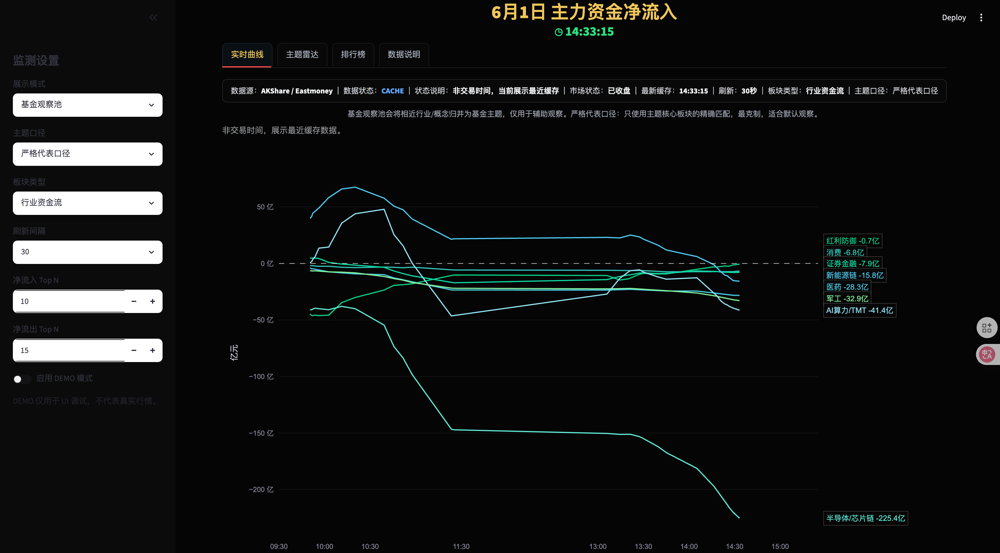
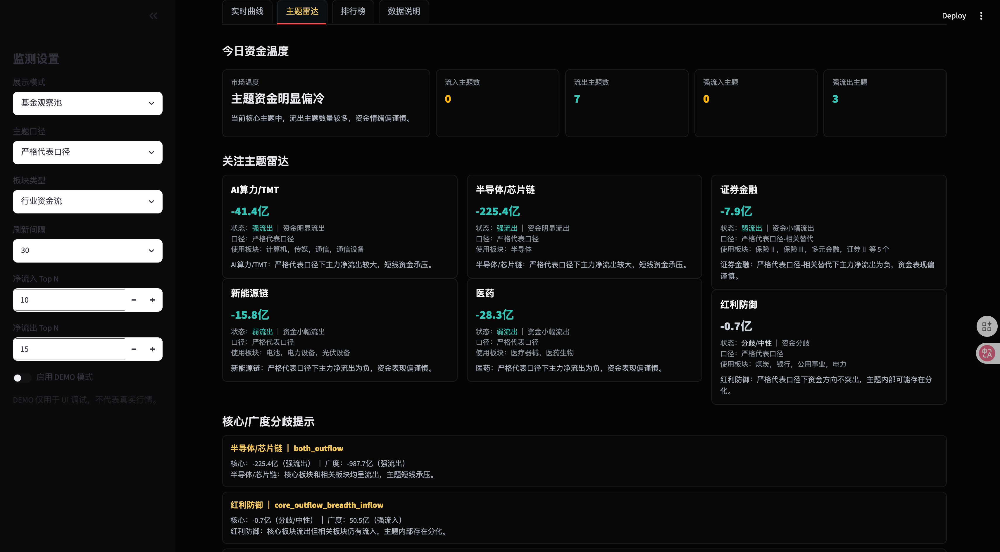
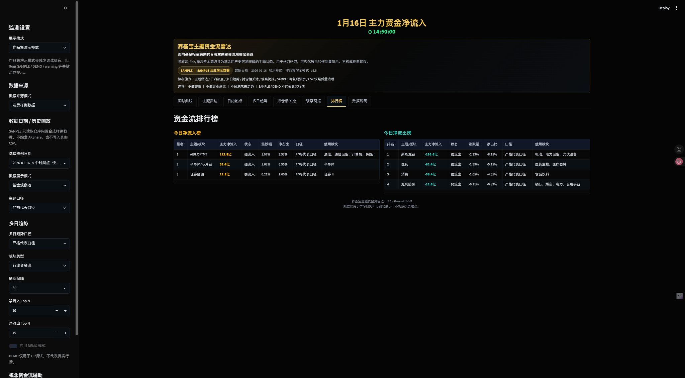
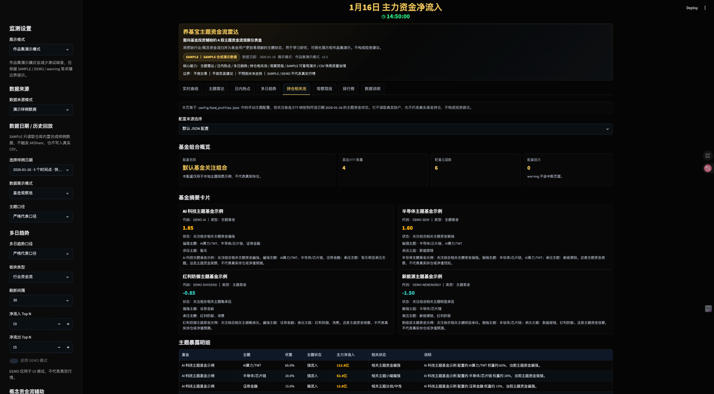
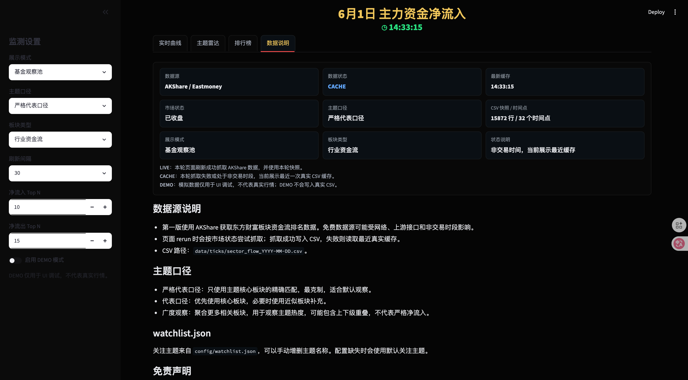
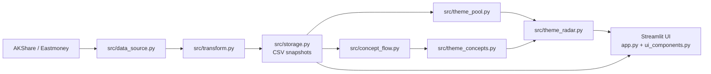

# Fund Flow Monitor / 养基宝主题资金流雷达

## 1. Project Overview

Fund Flow Monitor（养基宝主题资金流雷达）是一个基于 **Streamlit、AKShare、Plotly 和 pandas** 构建的 A 股主题资金流监测 MVP。项目使用 AKShare 获取东方财富行业/概念板块主力资金流数据，将盘中快照保存为本地 CSV，并通过“基金观察池”把原始行业板块归并为更适合基金投资观察的主题，例如半导体/芯片链、AI算力/TMT、新能源链、红利防御、医药和证券金融。

项目重点不是提供交易信号，而是解决普通资金流排行榜中常见的三个问题：

1. **数据状态不透明**：页面明确区分 `LIVE / CACHE / DEMO`，避免将缓存数据或模拟数据误认为实时行情。
2. **板块层级容易重复计数**：系统提供严格代表口径、代表口径和广度观察三种主题口径，用于区分核心板块资金流和主题热度观察。
3. **原始行业列表不够贴近基金视角**：通过关注主题雷达、今日资金温度、核心/广度分歧提示和 watchlist 配置，将资金流信息组织成更适合基金辅助观察的主题雷达。

这个项目面向“养基宝 / 基金投资辅助”场景：它不是普通基金净值工具，也不是交易系统。页面中的资金温度、主题雷达、分歧提示只用于观察已发生的资金流状态。

明确边界：

- 不提供交易功能。
- 不提供投资建议。
- 不预测未来走势。
- 免费数据源仅用于学习、研究和原型验证。

## 2. Key Features

- 实时主力资金净流入曲线：深色 Plotly 折线图，右侧 endpoint label 显示主题/板块和当前金额。
- `LIVE / CACHE / DEMO` 数据状态：区分本轮实时抓取、真实缓存和模拟数据。
- 基金观察池：将相近行业/概念归并为基金投资相关主题。
- 三种主题口径：严格代表口径、代表口径、广度观察。
- 今日资金温度：基于主题资金状态计算整体主题资金冷热。
- 关注主题雷达：按 `config/watchlist.json` 展示自选主题状态。
- 核心/广度分歧提示：对比核心板块和广度观察是否共振或分化。
- 低频概念资金流辅助：手动或过期刷新概念缓存，用于观察主题相关概念热度。
- 持仓相关池：基于 `config/fund_profiles.json` 的手动主题配置，把关注基金/ETF 映射到当前主题资金状态。
- 深色金融大屏：黑色背景、弱网格、深色排行榜和紧凑状态条。
- 本地 CSV 快照：第一版不依赖数据库，便于调试和迁移。

## Portfolio Description

这是一个从“复刻资金流动态图”进一步升级为“基金主题资金流雷达”的数据可视化项目。系统不仅展示 A 股行业/主题主力资金净流入曲线，还通过可解释的主题归并、三档口径和自选 watchlist，将原始板块资金流转换成更适合基金投资辅助观察的产品化视图。

核心设计包括：

- **可信数据状态**：通过 `LIVE / CACHE / DEMO` 避免缓存或模拟数据被误解为实时行情。
- **可解释主题口径**：通过严格代表口径、代表口径、广度观察区分核心板块资金流与主题热度。
- **基金观察池**：将原始行业板块映射为基金主题，支持半导体/芯片链、AI算力/TMT、新能源链、红利防御、医药、证券金融等观察方向。
- **产品化雷达层**：提供今日资金温度、关注主题雷达、核心/广度分歧提示和资金流排行榜。
- **轻量 MVP 架构**：使用 Streamlit + Plotly + AKShare + CSV 快照实现快速验证，后续可平滑升级到 FastAPI + React + ECharts。

## 3. Screenshots

### Real-time Fund Flow Curve

The real-time curve tab visualizes intraday main capital net inflow by selected fund themes or raw sectors. It keeps the dark financial dashboard style, shows the current data state, and marks endpoint labels on the right side of the chart.



### Fund Theme Radar

The theme radar tab summarizes current market temperature, watchlist theme status, and core-vs-breadth divergence. This is the key product layer that turns raw sector flow data into fund-oriented observation signals.



### Fund Flow Ranking

The ranking tab separates net inflow and net outflow lists. Inflow ranking only shows positive values, while outflow ranking only shows negative values, avoiding mixed-sign ranking confusion.



### Holding Related Pool

The holding-related pool maps manually configured fund/ETF theme exposure to current theme fund-flow status. It does not read real accounts and does not represent real holdings.



### Data Trust Panel

The data explanation tab shows the current data source, `LIVE / CACHE / DEMO` state, latest cache time, CSV snapshot count, theme mode explanation, watchlist usage, and disclaimer.



## 4. Architecture



## 5. Data Flow

1. 页面每次 rerun 时判断 A 股市场状态。
2. 交易中、集合竞价或午间休市时尝试抓取行业资金流数据。
3. 抓取成功：标准化字段，追加写入 `data/ticks/sector_flow_YYYY-MM-DD.csv`，页面显示 `LIVE`。
4. 抓取失败或非交易时段：优先读取最近真实 CSV 缓存，页面显示 `CACHE`。
5. DEMO 模式：只在内存生成模拟数据用于 UI 调试，页面显示 `DEMO`，不会写入真实 CSV。
6. 概念资金流采用低频策略：用户手动刷新、概念缓存为空或缓存超过 5 分钟时才尝试抓取。
7. 概念资金流只作为主题热度和分化的辅助观察数据，不与行业资金流直接相加。

## 6. Theme Modes

基金观察池不是简单求和，而是提供三种解释口径：

- `strict_representative / 严格代表口径`：只使用主题核心板块的精确匹配；若核心板块不存在，才使用精确匹配的相关板块作为替代并标记。默认使用该口径，最克制。
- `representative / 代表口径`：优先使用核心板块精确匹配，必要时允许核心板块包含匹配或相关板块 fallback。
- `breadth / 广度观察`：聚合核心板块和更多相关板块，用于观察主题热度。这个数值可能包含上下级板块重叠，不代表严格净流入。

当前主题映射仍是轻量规则，未来需要结合基金持仓、ETF 成分、申万/中信等行业分类体系继续校准。

## 7. Concept Assistance

v0.7 增加低频概念资金流辅助：

- 默认不会每 30 秒抓取概念资金流。
- 侧边栏开启“概念资金流辅助”后，可以点击“刷新概念资金流”。
- 当概念缓存为空或距离当前时间超过 5 分钟时，系统才会尝试低频刷新。
- 概念接口失败不会影响行业资金流主图、排行榜和主题雷达主链路。
- 概念数据写入同一个 CSV，但通过 `sector_type="概念资金流"` 与行业数据区分。
- 主题雷达中的“相关概念热度”只用于辅助观察，不替代行业主题主值。
- 行业资金流和概念资金流不会直接相加。

## 8. Fund Profiles

v0.8 增加本地手动配置版持仓相关池：

```text
config/fund_profiles.json
```

配置示例：

```json
{
  "profile_name": "默认基金关注组合",
  "description": "本配置仅用于本地主题观察示例，不代表真实持仓。",
  "funds": [
    {
      "fund_name": "半导体主题基金示例",
      "fund_code": "DEMO-SEMI",
      "fund_type": "主题基金",
      "themes": [
        {"theme_name": "半导体/芯片链", "weight": 0.75},
        {"theme_name": "AI算力/TMT", "weight": 0.15},
        {"theme_name": "新能源链", "weight": 0.10}
      ]
    }
  ]
}
```

说明：

- `fund_code` 示例使用 `DEMO-` 前缀，避免误解为真实基金代码。
- `themes` 是手动主题配置，不代表真实基金持仓。
- 系统不读取真实账户，不接券商接口，不抓取个人持仓。
- 权重仅用于把关注基金/ETF 映射到当前主题资金状态。
- 持仓相关池不预测基金净值，不构成投资建议。

## 9. Watchlist

关注主题来自：

```text
config/watchlist.json
```

示例：

```json
{
  "watchlist_name": "默认关注主题",
  "themes": [
    "半导体/芯片链",
    "AI算力/TMT",
    "新能源链",
    "红利防御",
    "医药",
    "证券金融"
  ]
}
```

可以手动增删 `themes` 中的主题名称。配置文件缺失或损坏时，程序会回退到默认关注主题。

## 10. Quick Start

```bash
cd fund-flow-monitor
python3 -m venv .venv
source .venv/bin/activate
pip install -r requirements.txt
python tools/verify_runtime.py
streamlit run app.py
```

可选：先检查 AKShare 接口。

```bash
python tools/probe_akshare.py
python tools/probe_concept_flow.py
```

## 11. Validation

```bash
python -m pytest -q
python -m compileall app.py src tests tools
python tools/smoke_check.py
python tools/verify_runtime.py
```

`tools/smoke_check.py` 不进行网络抓取，只检查 Python 版本、关键依赖、关键文件、watchlist 和本地 CSV 摘要。`tools/verify_runtime.py` 会进一步检查 AKShare 可用性、CSV 缓存、主题池、主题雷达和分歧提示。

## 12. Known Limitations

- AKShare / 东方财富免费接口可能受网络、代理、上游字段变化和访问限制影响。
- 当前暂未处理中国法定节假日，仅按周一至周五和盘中时间段判断市场状态。
- 当前使用 CSV，不适合长期生产环境。
- 主题映射仍是轻量规则，不等同于正式行业分类。
- 后续需要结合基金持仓、ETF 成分、行业分类体系继续校准主题池。
- 广度观察可能包含上下级板块重叠，只能作为主题热度观察。
- 概念资金流接口可能比行业接口更不稳定，因此当前只做低频辅助刷新。
- 持仓相关池只读取本地手动配置，不代表真实基金持仓或账户资产。

## 13. Roadmap

- v0.6：项目交付打磨，页面 tabs、README 作品集化、数据可信面板、文档整理。
- v0.7：低频概念资金流接入，概念热点观察和主题概念摘要。
- v0.8：手动配置版持仓相关池 / 基金主题配置。
- v0.9：日内热点池、更正式的 ETF / 基金成分映射。
- v1.0：FastAPI + React + ECharts 产品化重构。

本项目始终以可信的数据状态和可解释的主题观察为优先，不包含交易、预测或自动化决策能力。
