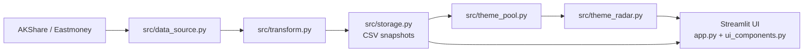

# Fund Flow Monitor / 养基宝主题资金流雷达

## 1. Project Overview

Fund Flow Monitor 是一个基于 Streamlit 的 A 股主题资金流监测 MVP。它使用 AKShare 获取东方财富行业/概念板块主力资金流数据，把实时快照保存为本地 CSV，并通过“基金观察池”把原始行业板块归并为更适合基金观察的主题。

这个项目面向“养基宝 / 基金投资辅助”场景：它不是普通基金净值工具，也不是交易系统。页面中的资金温度、主题雷达、分歧提示只用于观察已发生的资金流状态。

明确边界：

- 不提供交易功能。
- 不提供投资建议。
- 不预测未来走势。
- 免费数据源仅用于学习、研究和原型验证。

## 2. Key Features

- 实时主力资金净流入曲线：深色 Plotly 折线图，右侧 endpoint label 显示主题/板块和当前金额。
- `LIVE / CACHE / DEMO` 数据状态：区分本轮实时抓取、真实缓存和模拟数据。
- 基金观察池：将相近行业/概念归并为基金投资相关主题。
- 三种主题口径：严格代表口径、代表口径、广度观察。
- 今日资金温度：基于主题资金状态计算整体主题资金冷热。
- 关注主题雷达：按 `config/watchlist.json` 展示自选主题状态。
- 核心/广度分歧提示：对比核心板块和广度观察是否共振或分化。
- 深色金融大屏：黑色背景、弱网格、深色排行榜和紧凑状态条。
- 本地 CSV 快照：第一版不依赖数据库，便于调试和迁移。

## 3. Screenshots

请将运行页面截图保存到 `docs/screenshots/` 后在 README 中展示。

预留路径：

- `docs/screenshots/curve.png`
- `docs/screenshots/theme_radar.png`
- `docs/screenshots/ranking.png`

## 4. Architecture



## 5. Data Flow

1. 页面每次 rerun 时判断 A 股市场状态。
2. 交易中、集合竞价或午间休市时尝试抓取 AKShare 数据。
3. 抓取成功：标准化字段，追加写入 `data/ticks/sector_flow_YYYY-MM-DD.csv`，页面显示 `LIVE`。
4. 抓取失败或非交易时段：优先读取最近真实 CSV 缓存，页面显示 `CACHE`。
5. DEMO 模式：只在内存生成模拟数据用于 UI 调试，页面显示 `DEMO`，不会写入真实 CSV。

## 6. Theme Modes

基金观察池不是简单求和，而是提供三种解释口径：

- `strict_representative / 严格代表口径`：只使用主题核心板块的精确匹配；若核心板块不存在，才使用精确匹配的相关板块作为替代并标记。默认使用该口径，最克制。
- `representative / 代表口径`：优先使用核心板块精确匹配，必要时允许核心板块包含匹配或相关板块 fallback。
- `breadth / 广度观察`：聚合核心板块和更多相关板块，用于观察主题热度。这个数值可能包含上下级板块重叠，不代表严格净流入。

当前主题映射仍是轻量规则，未来需要结合基金持仓、ETF 成分、申万/中信等行业分类体系继续校准。

## 7. Watchlist

关注主题来自：

```text
config/watchlist.json
```

示例：

```json
{
  "watchlist_name": "默认关注主题",
  "themes": [
    "半导体/芯片链",
    "AI算力/TMT",
    "新能源链",
    "红利防御",
    "医药",
    "证券金融"
  ]
}
```

可以手动增删 `themes` 中的主题名称。配置文件缺失或损坏时，程序会回退到默认关注主题。

## 8. Quick Start

```bash
cd fund-flow-monitor
python3 -m venv .venv
source .venv/bin/activate
pip install -r requirements.txt
python tools/verify_runtime.py
streamlit run app.py
```

可选：先检查 AKShare 接口。

```bash
python tools/probe_akshare.py
```

## 9. Validation

```bash
python -m pytest -q
python -m compileall app.py src tests tools
python tools/smoke_check.py
python tools/verify_runtime.py
```

`tools/smoke_check.py` 不进行网络抓取，只检查 Python 版本、关键依赖、关键文件、watchlist 和本地 CSV 摘要。`tools/verify_runtime.py` 会进一步检查 AKShare 可用性、CSV 缓存、主题池、主题雷达和分歧提示。

## 10. Known Limitations

- AKShare / 东方财富免费接口可能受网络、代理、上游字段变化和访问限制影响。
- 当前暂未处理中国法定节假日，仅按周一至周五和盘中时间段判断市场状态。
- 当前使用 CSV，不适合长期生产环境。
- 主题映射仍是轻量规则，不等同于正式行业分类。
- 后续需要结合基金持仓、ETF 成分、行业分类体系继续校准主题池。
- 广度观察可能包含上下级板块重叠，只能作为主题热度观察。

## 11. Roadmap

- v0.6：项目交付打磨，页面 tabs、README 作品集化、数据可信面板、文档整理。
- v0.7：低频概念资金流接入。
- v0.8：基金持仓 / ETF 成分映射。
- v0.9：持仓相关池、日内热点池。
- v1.0：FastAPI + React + ECharts 产品化重构。

本项目始终以可信的数据状态和可解释的主题观察为优先，不包含交易、预测或自动化决策能力。
